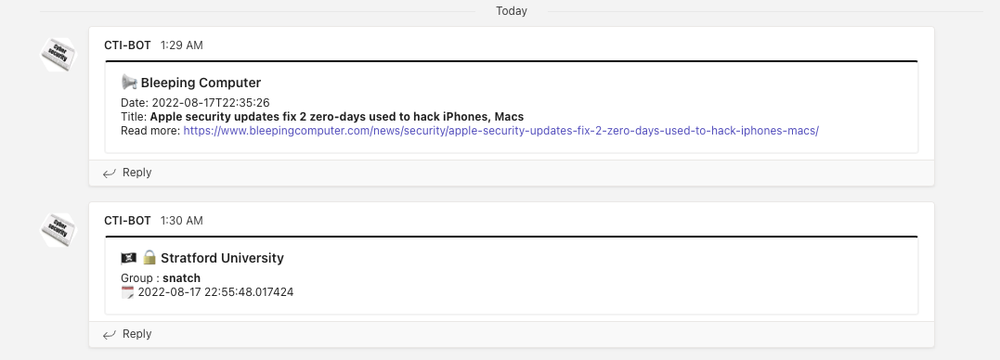

# 🏴‍☠️🤖 Threat Intelligence Teams Bot

TITB is a fork from [Threat Intelligence Discord Bot from vx-underground](https://github.com/vxunderground/ThreatIntelligenceDiscordBot/) but for Microsoft Teams and modified to work as an hourly Github-Action

> The vx-underground Threat Intelligence Discord Bot gets updates from various clearnet domains, ransomware threat actor domains This bot will check for updates in intervals of 1800 seconds.

[](LICENSE)   [](https://twitter.com/JMousqueton) [](.github/workflows/fetchCTI.yml)  [](.github/workflows/codeql-analysis.yml)

## Description

* Written in Python

   ⚠️ required version Python 3.10+
* Requires Teams Webhook

Threat Intelligence Teams Bot gets updates from various clearnet domains and ransomware threat actor domains.

This bot will check for updates every 30 minutes.

The change I've made :

* GitHub-Action : see the [fetchCTI.yml](.github/workflows/fetchCTI.yml) file.
* Feeds List is externalized from the source code to the file [Feed.csv](Feed.csv)
* Use JSON lib to get ransomware attacks list from [Ransomwatch](https://ransomwatch.mousqueton.io)
* Add an emoji in front of the MS Teams Card related to some sources
* Use only one MS Teams Channel
* Refactoring with best practices
* No need to add any entry in [Config.txt](Config.txt) (automaticaly add)
* Check that python 3.10+ is present (needed for some functions)
* Add a [requirements.txt](requirements.txt)
* Add a [feedCheck.py](checkFeed.py) script to check the health of the feed from [Feed.csv](Feed.csv) file
* Add Options for command line [usage](#usage)
* Check if a new version is available
* Add [new sources](#sources)
* Roll-back to several Webhooks 

I've decided to remove the TelegramBot because it was not relevant for my needs.



## Installation

Clone the repository or download the [latest release](https://github.com/JMousqueton/CTI-MSTeams-Bot/releases/latest)

```bash
git clone https://github.com/JMousqueton/CTI-MSTeams-Bot
```

Install all the modules in ```requirements.txt```

```bash
pip3 install -r requirements.txt
```

## Configuration

### Github Action

* Create a MS-Teams WebHook  
* in an environment you will called `CI`, paste the created webhook url in `MSTEAMS_WEBHOOK_*` variables.

### On a server (Windows, MacOS, Linux)

* Create a variable called ```MSTEAMS_WEBHOOK_*``` with the webhook URL

Example:

```bash
MSTEAMS_WEBHOOK_FEED=https://mousqueton.webhook.office.com/webhookb2/08589F1C-EEA2-4C92-A08B-66E59692FDE3/IncomingWebhook/3DEFFDD9-F3A8-4351-BDA7-142FAFB7473A
MSTEAMS_WEBHOOK_RANSOMWARE=https://mousqueton.webhook.office.com/webhookb2/08589F1C-EEA2-4C92-A08B-66E59692FDE3/IncomingWebhook/3DEFFDD9-F3A8-4351-BDA7-142FAFB7473A
MSTEAMS_WEBHOOK_IOC=https://mousqueton.webhook.office.com/webhookb2/08589F1C-EEA2-4C92-A08B-66E59692FDE3/IncomingWebhook/3DEFFDD9-F3A8-4351-BDA7-142FAFB7473A
python3 TeamIntelBot.py -r -d 
```

* Schedule the script for example every hours via the crontab

*Note: the IDs have been generated with uuidgen for example purpose* 😛

## Usage

```bash
python3 TeamsIntelBot.py -h
Usage: TeamsIntelBot.py [options]

Options:
  --version       show program's version number and exit
  -h, --help      show this help message and exit
  -q, --quiet     Quiet mode
  -D, --debug     Debug mode : only output on screen nothing send to MS Teams
  -d, --domain    Enable Red Flag Domains source
  -r, --reminder  Enable monthly reminder of Feeds
```

- For french user, I recommand using flags -d and -r

```python3 TeamIntelBot.py -r -d```

- For other, only flag -r

```python3 TeamIntelBot.py -r```

### Proxy

If you use a proxy don't forget to use the proxies variables:

```bash
set https_proxy=http://x.x.x.x:port
set http_proxy=http://x.x.x.x:port
```

I've also add a script called ```checkFeed.py``` to check if feeds are valid and what is the last published date. This script read the ```Feed.csv``` file.

```bash
python3 checkFeed.py 

✅ Modexp (Sun, 31 Jul 2022 00:01:53 +0000)
✅ James Forshaw (2022-07-16T21:49:00.000-07:00)
✅ Adam Chester (Sat, 09 Jul 2022 23:00:00 GMT)
✅ Microsoft Security (Thu, 11 Aug 2022 16:00:00 +0000)
✅ Recorded Future (Thu, 18 Aug 2022 00:00:00 GMT)
✅ SentinelOne (Wed, 11 May 2022 14:56:53 +0000)
✅ RedCanary (Thu, 18 Aug 2022 21:53:55 +0000)
✅ Cyber-News (Fri, 19 Aug 2022 15:14:56 +0000)
✅ Leak-Lookup (Fri, 19 Aug 2022 04:00:02 +0200)
✅ ATT (2022-08-17T10:00:00+00:00)
✅ US-CERT CISA (Tue, 16 Aug 2022 15:38:42 +0000)
✅ NCSC (Thu, 18 Aug 2022 23:00:00 GMT)
✅ Center of Internet Security (Thu, 18 Aug 2022 01:43:07 -0400)
✅ FR-CERT Alertes (Tue, 31 May 2022 11:12:01 +0000)
✅ FR-CERT Avis (Fri, 19 Aug 2022 11:22:29 +0000)
✅ EU-ENISA Publications (2022-07-27T10:00:00Z)
✅ Microsoft Sentinel (Thu, 18 Aug 2022 08:31:51 PDT)
```

## Adding or removing RSS Feeds to monitor
All monitored RSS feeds are in [Feed.csv](Feed.csv) file. To add a new RSS feed simply append a new entry. e.g.

In the ```Feed.csv``` file:

```text
https://grahamcluley.com/feed/,Graham Cluley
https://1337WebsiteIWannaFollow.com/feed/,1337Website
```

## Sources

I've added the following sources :

* 🇫🇷 FR-CERT Avis (aka [ANSSI](https://www.ssi.gouv.fr/)) : notifications from gov French CERT
* 🇫🇷 FR-CERT Alertes (aka [ANSSI](https://www.ssi.gouv.fr/)) : Alerts from gov French CERT
* [Leak-lookup](https://leak-lookup.com/) : Leak notification
* [Cyber-News](https://www.cyber-news.fr)
* ATT CyberSecurity Blog
* 🇪🇺 ENSIA Publications
* NCC Group
* Microsoft Sentinel
* SANS
* [Red Flag Domains](https://red.flag.domains/) ⚠️ You shoudl use -d flag to enable this source dedicated to France
* [Google TAG](https://blog.google/threat-analysis-group/)  

## ToDo

* ~~Create a flag to activate or not the Red Flag Domains source because it's only for french~~ (released in version 2.3)
* ~~Disable line with # in [Feed.csv](Feed.csv)~~ (in version 2.4 not released yet)

## Credit

This was made by smelly__vx over a slow and boring weekend. We hope it provides some value to your channel and/or organization.

Thanks to my fellow students from [🏴‍☠️ Ecole 2600](https://www.ecole2600.com) for the support and advice during nights 😛

Thanks to the current users of this Bot who help me to improve it

Thanks to Olivier for the proxy documentation 🍻
